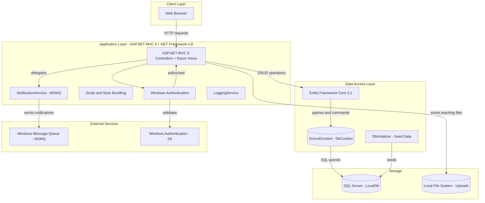
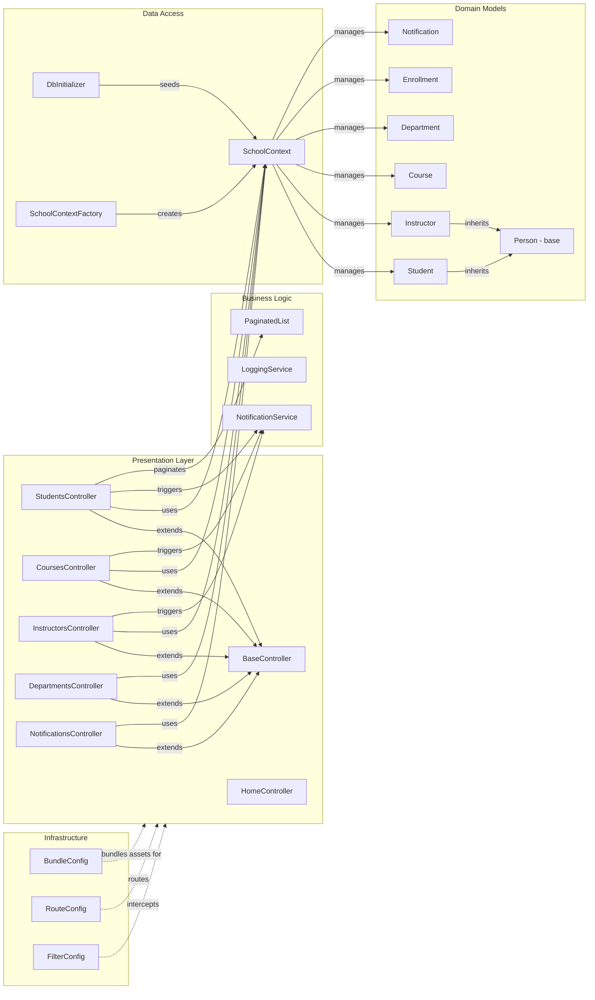

# Architecture Diagram

ContosoUniversity is a .NET Framework 4.8 ASP.NET MVC 5 application for university management, using Entity Framework Core 3.1 for data access, SQL Server for persistence, MSMQ for notifications, and local file storage for teaching material uploads.

## Application Architecture

## Component Relationships

