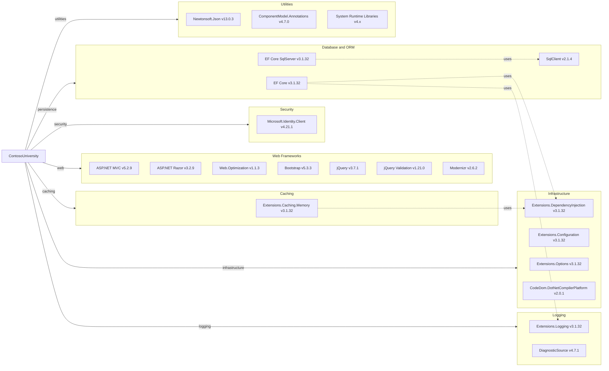

# Dependency Map

ContosoUniversity declares 47 NuGet packages spanning web framework, data access, security, caching, logging, and utility libraries for a .NET Framework 4.8 ASP.NET MVC 5 application.

## Dependencies

