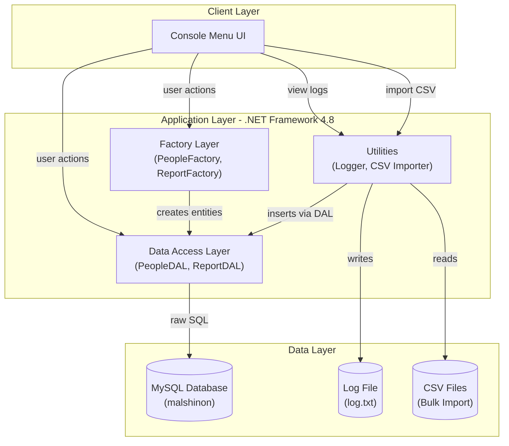
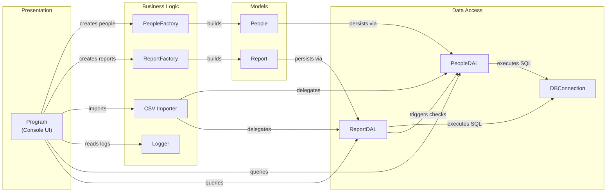

# Architecture Diagram

Malshinon is a .NET Framework 4.8 console application that manages intelligence reports between agents and targets, using a MySQL database for persistence and a factory/DAL pattern for data operations.

## Application Architecture

## Component Relationships

