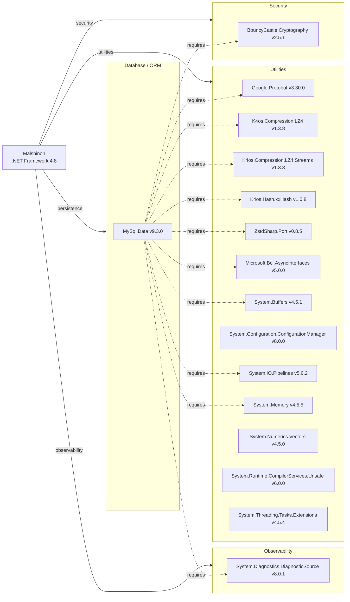

# Dependency Map

Malshinon (.NET Framework 4.8) declares 16 external dependencies, primarily driven by the MySql.Data database driver and its transitive requirements.

## Dependencies

```mermaid
flowchart LR
    App["Malshinon\n.NET Framework 4.8"]

    subgraph DB["Database / ORM"]
        MySql["MySql.Data v9.3.0"]
    end
    subgraph Sec["Security"]
        Bouncy["BouncyCastle.Cryptography v2.5.1"]
    end
    subgraph Util["Utilities"]
        Protobuf["Google.Protobuf v3.30.0"]
        LZ4["K4os.Compression.LZ4 v1.3.8"]
        LZ4S["K4os.Compression.LZ4.Streams v1.3.8"]
        xxHash["K4os.Hash.xxHash v1.0.8"]
        Zstd["ZstdSharp.Port v0.8.5"]
        AsyncInterfaces["Microsoft.Bcl.AsyncInterfaces v5.0.0"]
        Buffers["System.Buffers v4.5.1"]
        Config["System.Configuration.ConfigurationManager v8.0.0"]
        Pipelines["System.IO.Pipelines v5.0.2"]
        Memory["System.Memory v4.5.5"]
        Vectors["System.Numerics.Vectors v4.5.0"]
        Unsafe["System.Runtime.CompilerServices.Unsafe v6.0.0"]
        Tasks["System.Threading.Tasks.Extensions v4.5.4"]
    end
    subgraph Obs["Observability"]
        Diagnostics["System.Diagnostics.DiagnosticSource v8.0.1"]
    end

    App -->|"persistence"| DB
    App -->|"security"| Sec
    App -->|"utilities"| Util
    App -->|"observability"| Obs
    MySql -.->|"requires"| Bouncy
    MySql -.->|"requires"| Protobuf
    MySql -.->|"requires"| LZ4
    MySql -.->|"requires"| LZ4S
    MySql -.->|"requires"| xxHash
    MySql -.->|"requires"| Zstd
    MySql -.->|"requires"| AsyncInterfaces
    MySql -.->|"requires"| Buffers
    MySql -.->|"requires"| Pipelines
    MySql -.->|"requires"| Memory
    MySql -.->|"requires"| Diagnostics
```
