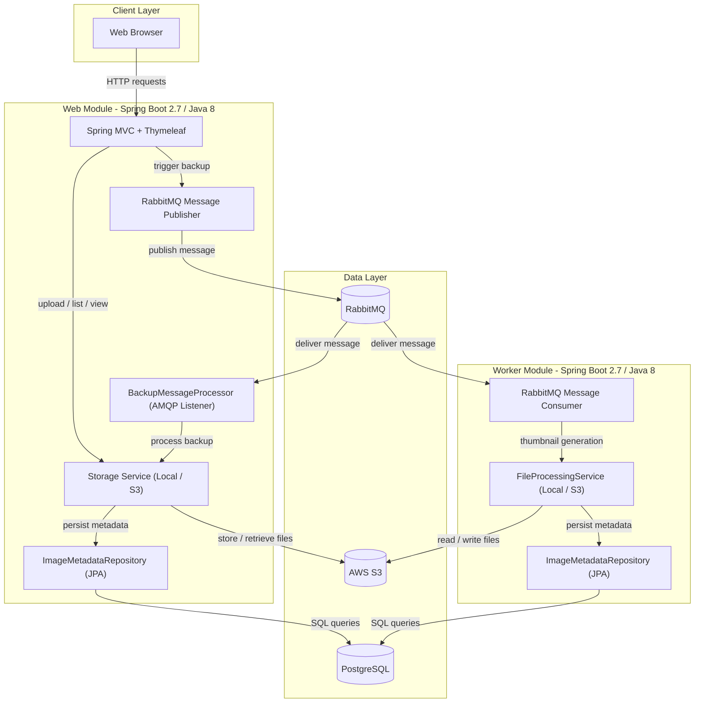
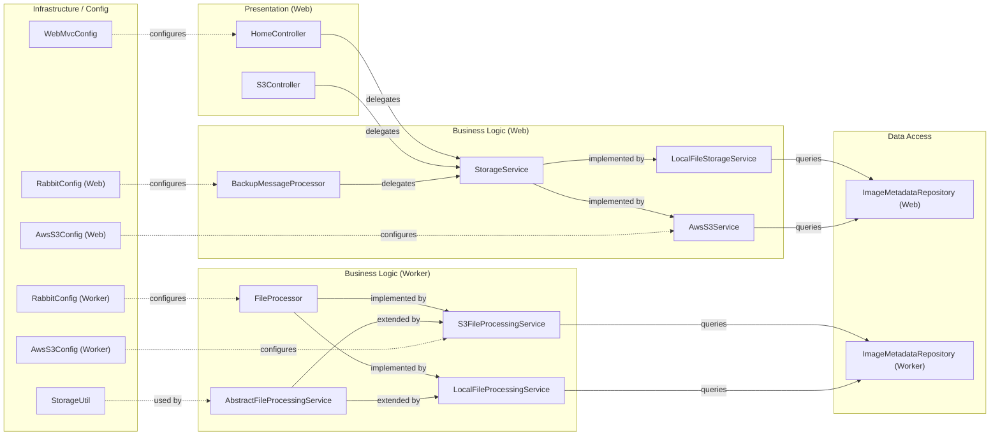

# Architecture Diagram

The Asset Manager is a multi-module Spring Boot 2.7 application comprising a web frontend for file upload and viewing, and a background worker for image processing, both sharing AWS S3 storage, RabbitMQ messaging, and a PostgreSQL database.

## Application Architecture

## Component Relationships

