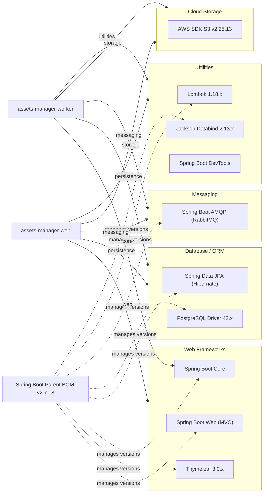

# Dependency Map

The Asset Manager project is a two-module Maven application (web + worker) with 10 unique declared external dependencies managed via the Spring Boot 2.7.18 parent BOM.

## Dependencies

