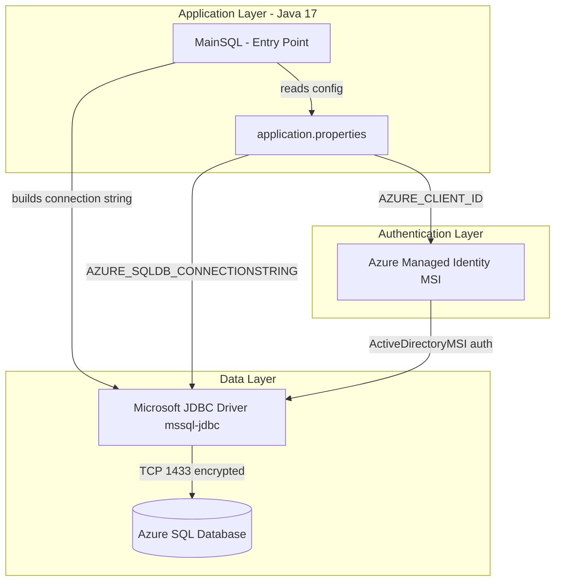
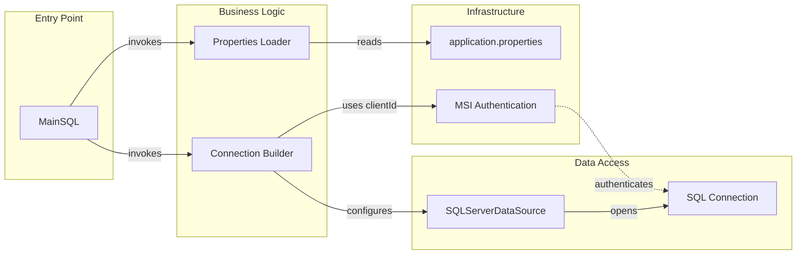

# Architecture Diagram

This is a standalone Java console application that connects to Azure SQL Database using Managed Identity (MSI) authentication via the Microsoft JDBC driver.

## Application Architecture

## Component Relationships

