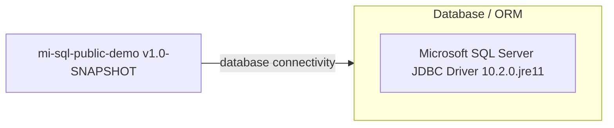

# Dependency Map

The `mi-sql-public-demo` project declares 1 external runtime dependency managed via Maven (pom.xml).

## Dependencies

```mermaid
flowchart LR
    App["mi-sql-public-demo v1.0-SNAPSHOT"]

    subgraph DB["Database / ORM"]
        MSSQL["Microsoft SQL Server JDBC Driver 10.2.0.jre11"]
    end

    App -->|"database connectivity"| DB
```
