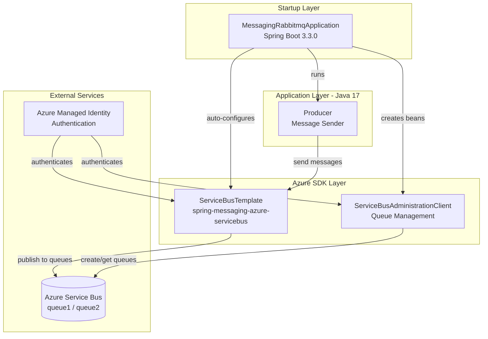
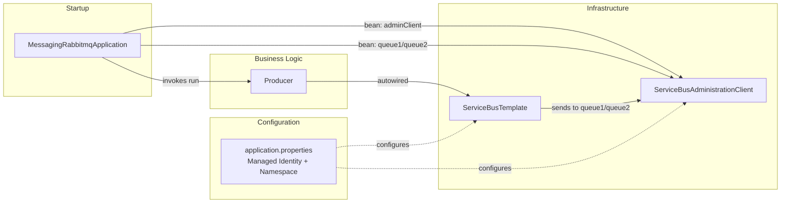

# Architecture Diagram

A Spring Boot 3.3.0 Java 17 application that sends messages to Azure Service Bus queues using Azure Spring Cloud SDK with Managed Identity authentication.

## Application Architecture

## Component Relationships

