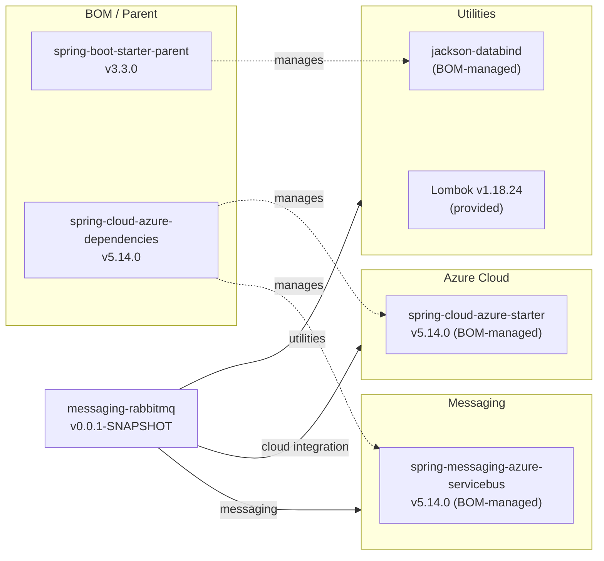

# Dependency Map

The `messaging-rabbitmq` Spring Boot 3.3.0 project declares 4 runtime/provided dependencies (test-scoped excluded), governed by the Spring Boot parent BOM and the Azure Spring Cloud BOM.

## Dependencies

