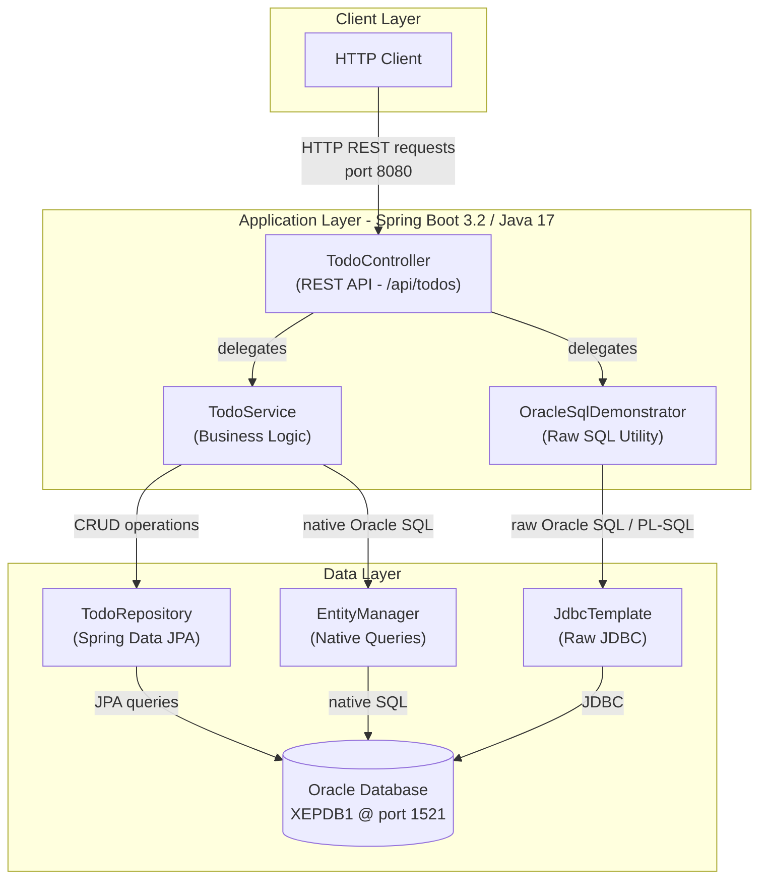
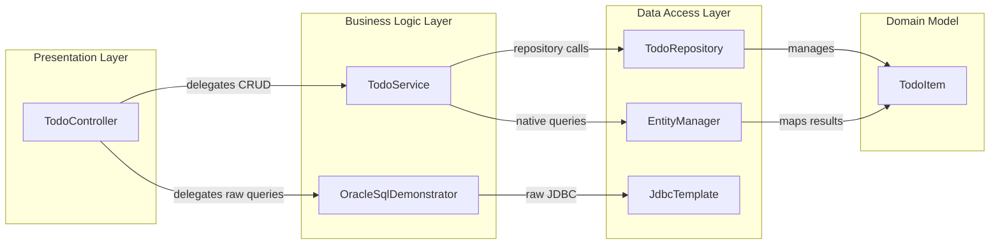

# Architecture Diagram

This Spring Boot 3.2 REST API application manages Todo items using an Oracle Database, exposing CRUD and search endpoints via HTTP on port 8080.

## Application Architecture

## Component Relationships

