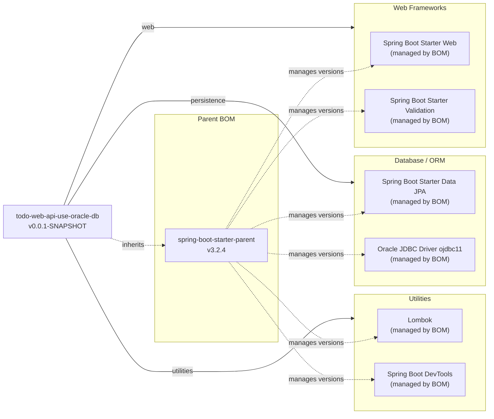

# Dependency Map

The `todo-web-api-use-oracle-db` project declares 6 runtime/compile dependencies (excluding test scope), with versions managed by the Spring Boot 3.2.4 parent BOM.

## Dependencies

